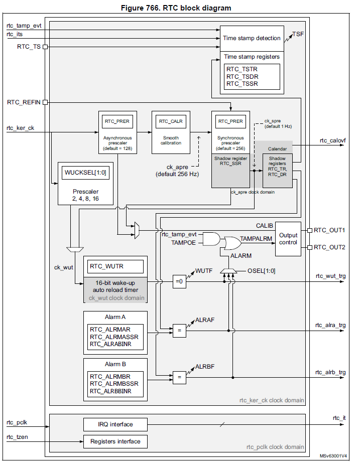

# Real-Time Clock

The Real-Time Clock (RTC) driver allows for the configuration and control of an independent BCD/Binary timer/counter that features alarms, timestamps, and a wake-up timer.

The RTC peripheral is part of the backup domain and can therefore be functional in all low-power modes. The RTC peripheral is critical for low-power applications as it is used to wake up the microcontroller from the different low-power modes.

## Operating condition

The real-time clock peripheral can be powered from Vbat when the main V<sub>dd</sub> supply is powered off. To retain the content of the RTC registers and supply the RTC when Vdd is turned off, V<sub>bat</sub> can be connected to an optional standby voltage supplied by a battery or another source.

The RTC clock, called RTCCLK, can come from different sources: HSE with a prescaler, LSE, or LSI with a prescaler. By default, all RTCs are configured to work with an LSE of 32.768 kHz. To work in low-power mode, the RTC clock source needs to be the LSE or LSI. [^1].


## Features




The RTC driver is compliant with the features of the RTC peripheral. It supports the following features::
* Configuration of the calendar with microseconds, milliseconds, seconds, minutes, hours (12 or 24 format), weekday, date, month, year, in BCD (binary-coded decimal) format, with all automatic correction for the calendar.
* Configuration of the binary mode with a 32-bit free-running counter.
* Configuration of the mixed mode of the calendar and 32-bit free-running counter.
* Configuration and use of the two programmable alarms.
* On-the-fly calibration of the RTC clock.
* Enabling the use of a reference clock to enhance the calendar precision.
* Digital calibration/shift of the seconds or subseconds of the calendar to compensate for clock imprecision.
* Configuration and use of the timestamp which can be used to save the calendar content when a certain event occurs. The timestamp can be triggered by a change in polarization in the timestamp pin, by a tamper event, or by a switch to the Vbat mode.
* 17-bit auto-reload wake-up timer (WUT) for periodic events with programmable resolution and period.
* Interrupt handlers to manage the interrupts of the alarms, timestamps, and wake-up timer events which can be used to wake up the device from all low-power modes.

## API

```mdx-code-block
import DocCardList from '@theme/DocCardList';

<DocCardList />
```

## List of examples (to improve see how ?)

* RTC Calendar
* RTC Alarm
* RTC Wake-up
* RTC Chronometer
* RTC Timestamp
* RTC InternalTimestamp
* RTC TrustZone


## See more ( to improve see how ?)

* RCC
* TAMPER
* PWR
* backup domain.

[^1] Not all low-power modes are available when using LSI.