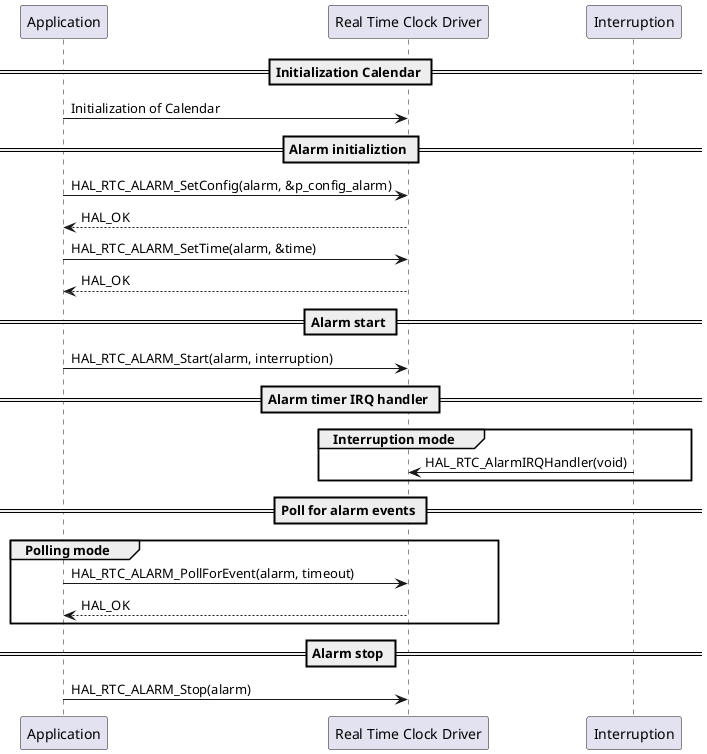

# Alarms description

The following section describes the user sequence of the RTC alarms.

```plantuml
@startuml

participant Application as app
participant "Real Time Clock Driver" as rtc
participant "Interruption" as int

== Initialization Calendar ==

app -> rtc : Initialization of Calendar

== Alarm initializtion ==

app -> rtc : HAL_RTC_ALARM_SetConfig(alarm, &p_config_alarm)
rtc --> app : HAL_OK

app -> rtc : HAL_RTC_ALARM_SetTime(alarm, &time)
rtc --> app : HAL_OK

== Alarm start ==

app -> rtc: HAL_RTC_ALARM_Start(alarm, interruption)

== Alarm timer IRQ handler ==
group Interruption mode
int -> rtc : HAL_RTC_AlarmIRQHandler(void)
end
== Poll for alarm events ==

group Polling mode
app -> rtc: HAL_RTC_ALARM_PollForEvent(alarm, timeout)
rtc --> app: HAL_OK
end

== Alarm stop ==

app -> rtc: HAL_RTC_ALARM_Stop(alarm)

@enduml
```
