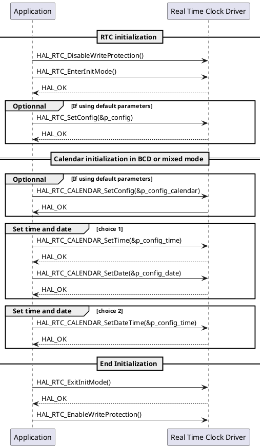

---
keywords:
    - RTC
    - Calendar
    - User sequence
    - HAL
    - STM32
    - STMicroelectronics
tags:
    - HAL
    - Drivers
---

# Calendar user sequence {#dynamic_calendar_behavior}

The following section describes the user sequence of the RTC calendar

