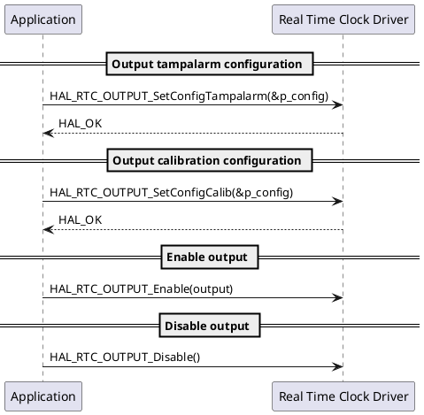

---
keywords:
    - RTC
    - RTC initialization
    - User sequence
    - HAL
    - STM32
    - STMicroelectronics
    - Low power
tags:
    - HAL
    - Drivers
draft: true
---

# Output user sequence {#dynamic_output_behavior}

The following section describes the user sequence of the output

