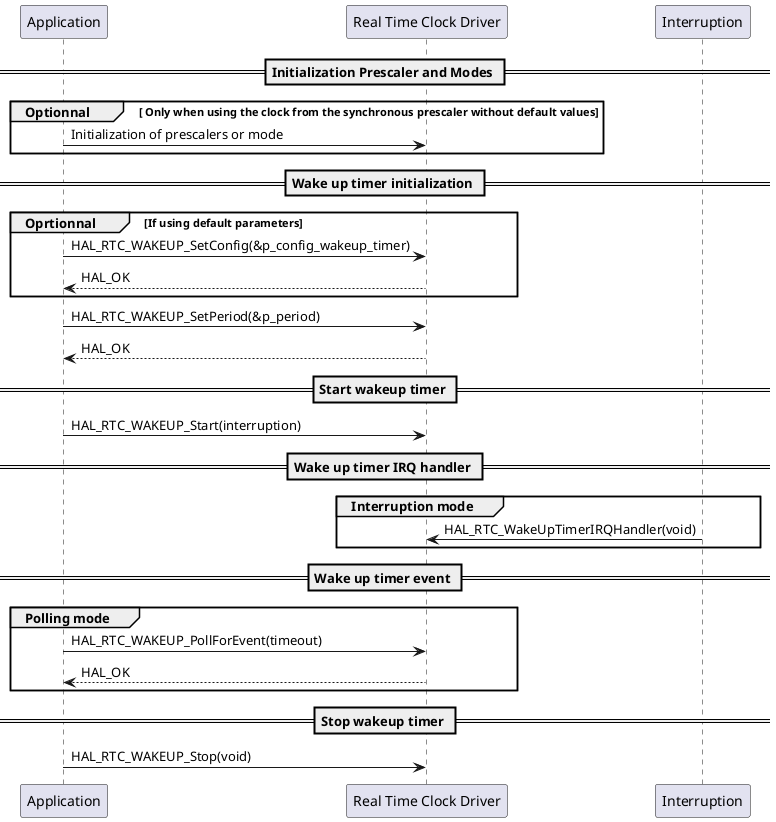

---
keywords:
    - RTC
    - Wake-up timer
    - User sequence
    - HAL
    - STM32
    - STMicroelectronics
    - Low power
tags:
    - HAL
    - Drivers
---

# Wake-up timer user sequence {#dynamic_wakeup_behavior}

The following section describes the user sequence of the wake-up timer

