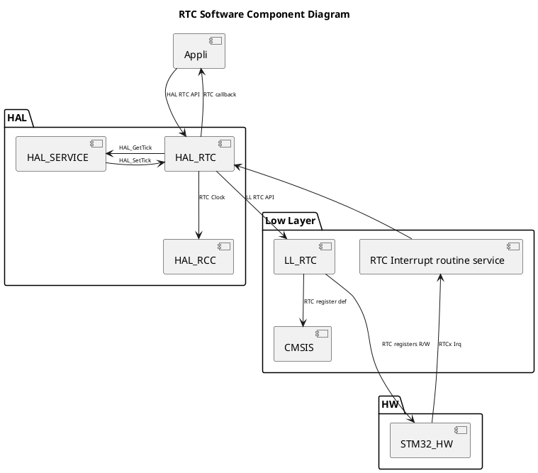

---
keywords:
    - RTC
    - Component diagram
    - HAL
    - STM32
    - STMicroelectronics
tags:
    - HAL
    - Drivers
draft: true
---

# RTC Component Diagram {#component_diagram}

phrase explicative

