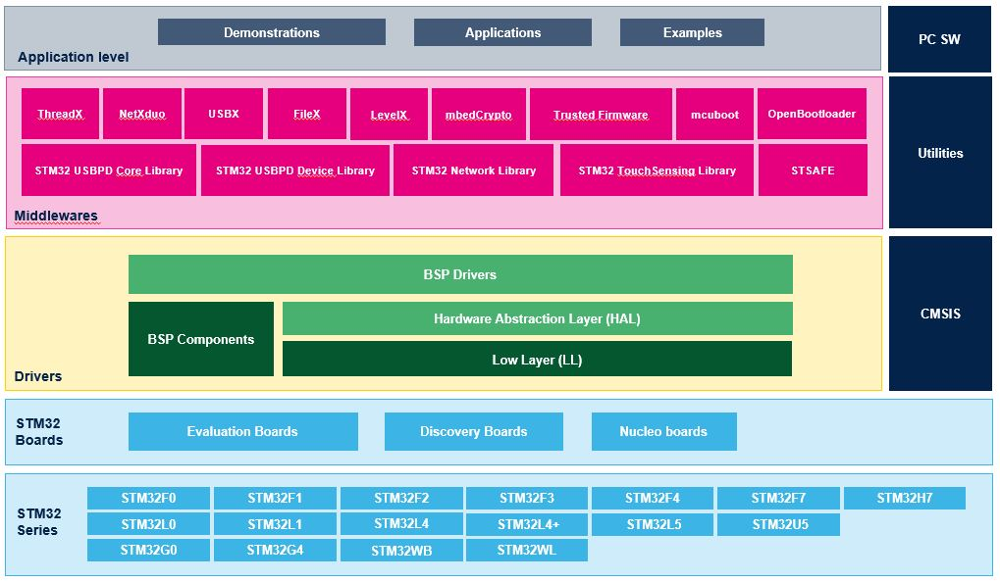

import {YouTube} from 'mdx-embed'

# STM Cube

<YouTube youTubeId="0OjPY-3qMNU"/>

*STMCube is an STMicroelectronics original initiative to ease developers life by reducing development efforts, time and cost.*

STM32Cube covers STM32 portfolio.

STM32Cube Version 1.x includes:

* The STM32CubeMX, a graphical software configuration tool that allows to generate C initialization code using graphical wizards.
* A comprehensive embedded software platform, delivered per series (such as STM32CubeU5 for STM32U5 series)

  * The STM32Cube HAL, an STM32 abstraction layer embedded software, ensuring maximized portability across STM32 portfolio
  * A consistent set of middleware libraries such as ThreadX, FileX, USBX, NetDuoX, OpenBootloader, USBPD, trustedfirmware, mbed-crypto, Network Library…
  * A full set of software projects (basic examples, applications, and demonstrations) for each board provided for this STM32 series.
  * A new LPBAM (Low Power Background Autonomous Mode) utility which is a software helper that assists STM32U5 users in the elaboration of LPBAM scenarios.

The STM32Cube firmware solution offers a straightforward API with a modular architecture, making it simple to fine tune custom applications and scalable to fit most requirements.
Both the HAL and LL APIs are production–ready, checked with CodeSonar® static analysis tool, and developed in compliance with MISRA C® guidelines, following a process certified according to IEC 61508 systematic capability 2 level (SC2). Reports are available on demand.

The drivers provided within this package support the devices:

* STM32U575
* STM32U585
* STM32U595xx
* STM32U5A5xx
* STM32U599xx
* STM32U5A9xx

For quick getting started with the STM32CubeU5 firmware package, refer to [UM2883](https://www.st.com/resource/en/user_manual/um2883-getting-started-with-stm32cubeu5-for-stm32u5-series-stmicroelectronics.pdf) you can download firmware updates and all the latest documentation from [www.st.com/stm32cubeU5](https://www.st.com/stm32cubeU5)
* Below links to the most useful documents:

  * [UM2883: Getting started with STM32CubeU5 for STM32U5 Series](https://www.st.com/resource/en/user_manual/um2883-getting-started-with-stm32cubeu5-for-stm32u5-series-stmicroelectronics.pdf)
  * [UM2911: Description of STM32U5 HAL and low-layer driver](https://www.st.com/resource/en/user_manual/um2911-description-of-stm32u5-hal-and-lowlayer-driver-stmicroelectronics.pdf)
  * [UM2298: STM32Cube BSP drivers development guidelines](https://www.st.com/resource/en/user_manual/um2298-stm32cube-bsp-drivers-development-guidelines-stmicroelectronics.pdf)
  * [UM2913: STM32CubeU5 B-U585I-IOT02A web server demonstration firmware](https://www.st.com/resource/en/user_manual/um2913-stm32cubeu5-bu585iiot02a-web-server-demonstration-firmware-stmicroelectronics.pdf)
  * [UM2912: STM32CubeU5 STM32U575I-EV demonstration firmware](https://www.st.com/resource/en/user_manual/um2912-stm32cubeu5-stm32u575iev-demonstration-firmware-stmicroelectronics.pdf)
  * [UM2851: Getting started with STM32CubeU5 TFM application](https://www.st.com/resource/en/user_manual/um2851-getting-started-with-stm32cubeu5-tfm-application-stmicroelectronics.pdf)
  * [UM2852: STM32U585xx security guidance for PSA Certified™ Level 3 with SESIP Profile](https://www.st.com/resource/en/user_manual/um2852-stm32u585xx-security-guidance-for-psa-certified-level-3-with-sesip-profile-stmicroelectronics.pdf)